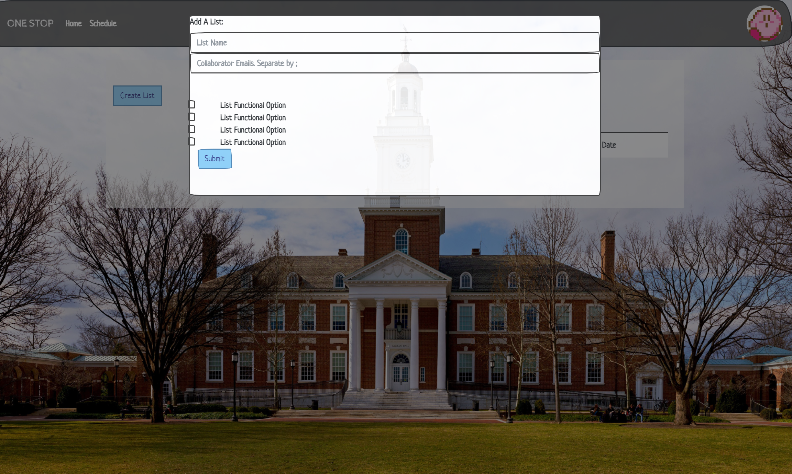
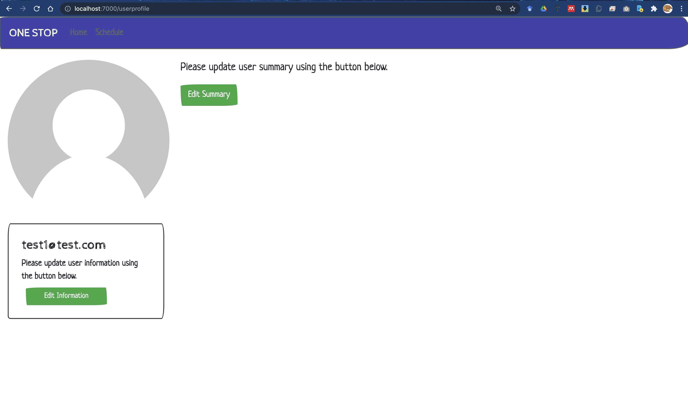
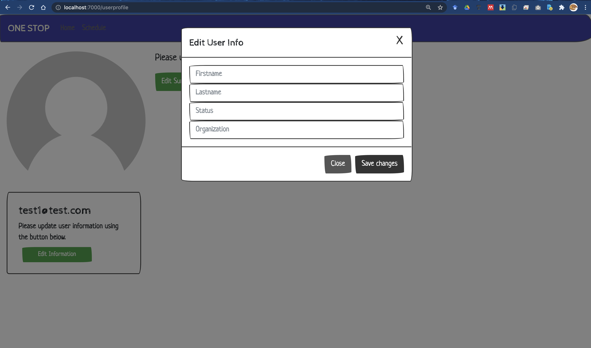
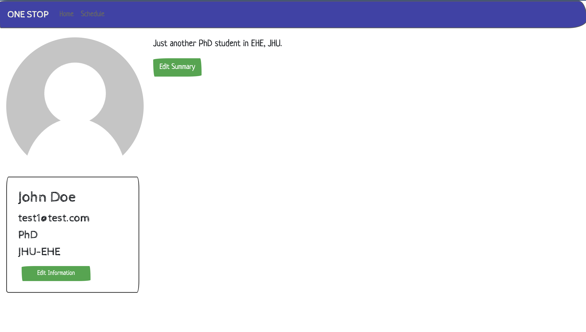
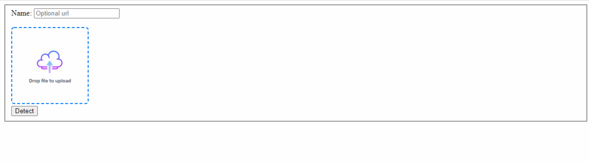
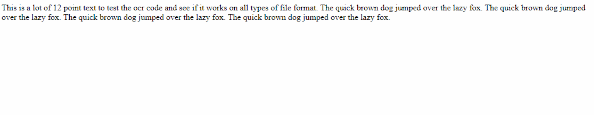

# Placeholder project documentation

## About The Project
> Placeholder Project is a Task Manager project that allow users to manage lists of tasks manually as well as automatically
> suggest the best schedule pattern to a user.

### Built With

- Spark
- Apache Velocity
- JavaScript

## Getting Started
### Prerequisite
- IntelliJ Idea integrated development environment
	- The project development is done in Idea and is currently not deployed to a remote web server.
	- Java version in use is Java 8. The configuration should be automatically loaded with the project folder.

### Installation / Run
- Run the file *2021-fall-group-placeholders/placeholder/src/main/java/Controllers/Main.java*
- Type in localhost:7000/ in your browser to direct to app page
- You can run the application by visiting http://18.144.173.7:7000
- You can also run the application by visiting https://onestop-dev-ph.herokuapp.com/

## Usage
The default end-point will re-direct to login page, if no cache was previously stored.

### Login/Signup Page
- Click on the signup button on the login page if you has not created an account. Or, type in localhost:7000/main in your browser to use it as a local app.
- If you forget your password, you can reset your password in localhost:7000/main page.
- If you enter a invalid account when signing in, the system will show that the account is not exist.
- If you enter a wrong password, the system will alarm that your password is incorrect.

- Login with an account and password if having an existing account, or sign up for a new account otherwise. The password will be encrypted using SHA-256.
- After login/signup, user's task home page would be displayed.

### Home Page
- If logged in, the displayed lists belong to the lists owner or the logged in user is a collaborator for those lists. If using it as a local app, the lists that are visible are the ones that do not have an owen or a collaborator.

- Click on the Create List button to add a list.

- Add collaborators by inputing their user emails. Separate by semicolon.

- The lists on the main page will be those that belong to the logged-in user or the user is a collaborator.
- Click on the Delete List button to delete a list.
- Click on a created list to check the items inside.
- Click on the Add Task button to add a task in the highlighted created list.
- Click on the Delete Task button to delete a task from the chosen list.
- Click on the Task Detail button to view the notes, like special instruction, of a task.
- Click on the profile photo for the user profile page.
- Navigate to Home Page, Profile Page, and Schedule Page through NavBar.

### User Profile page

- Once logged in, click the icon at the upper right cornor to enter user profile page.
- Newly registered user should only have his/her email displayed on the page.

- Update the user information and user summary using buttons on the page.

- Once updated, the page should look like this:
- We provide some images chosen as the profile image.

### Task Detail Page
- The defualt note of a task would be empty. Click on the Edit button in order to edit task notes.
- Once the Edit button is clicked, it will prompt user to a dialog box, where user can input the notes and select the following functionalities:
  1. Fix fullstop -- by selecting this functionality, the missing fullstops will be inserted, or the unnecessary capital letters will become
     lower case letters. The program will decide which of the two things will it do, base on if the problematic word is a noun or not.
  2. Fix Spelling -- by selecting this functionality, the program will check if the input string is free of spelling mistake. (However, it can't
     correct words that can be found in dictionary-- for example, if a user misspell "Catt" for "Cat", the auto correction does not apply because
     "Catt" can be found in dictionary.) Once the program found a misspelled word, program generate a phrase that combines the word before the
     misspelled word(if any) and at most 5 possible replacements of the misspelled word, and find the phrase that has the highest frequency on
     the Google NGram Viewer. Then it corrects user's string into that string.
  3. Fix Capital -- by selecting this functionality, the program finds the words that have capital letters not positioned at the front of the string.
     Then those capital letters would be changed to lower case letter.
  4. Fix Long Running-- by selecting this functionality, if the input string is too long, the program finds a conjunction in the sentence and split the
     sentence into half, by putting a comma in front of the conjunction.

The fix spelling has consistency issue- for some input strings, the Fix Spelling function doesn't work consistently. It will still generate a string that is free of spelling mistakes, but everytime it outputs different string that are similar. However, when we step into debugger hoping to discover where the inconsistency arises, the returning string suddenly becomes consistent. (Update: the string functions still need to be fixed)
### Schedule Page
- A visualization of all tasks added would be displayed in the Monthly Calendar.
- A weekly calendar would be added in the future so that a auto-schedule algorithm could be displayed more specifically.

### Auto-scheduling
- An autoscheduling function is implemented: the program assumes that everyone is avaliable from 9:00 am to 9:00 pm. Then, for each task that user inputs, user needs to specify the duration of the task takes. Depending on the time that the task will take, the task might be split up into multiple parts so that it can fit in to the schedule: e.g. if a task takes 30 hours and the user has a start day of 10/25 and end day of 10/28, then this task will be split into 2 subtasks that takes 12 hours each on 10/26 and 10/27, and 1 subtask that takes 6 hours on 10/28. This feature also remembers the time that user already used: In the previous example, if we were to add another task that takes 4 hours and the user has a start day of 10/25 and end day of 10/28, then this task will be a 4-hour task on 10/28, because the 12 hours of 10/26 and 10/27 are already take.

- When we delete a task, the time that is 'taken' by that task will be given back-- for example, suppose a task A takes 8 hours on 10/26. If we were to add a new task that starts on 10/26 and ends on 10/28, taking 6 hours, then this task will be split into a 4 hour task on 10/26 and a 2 hour task on 10/27. However, if we delete A, then when we add a new task that starts on 10/26 and ends on 10/28, takes 6 hours, then this task will be put as a 6 hour task on 10/26.

### Image Detection
- Image detection is used to convert a picture into notes. The API was successfully implemented, but due to the compatibility issue of Heroku to Google Cloud API, it is not integrated to the main app. Instead, a demo app is provided in the folder TextDetect. Note, to run the app locally, a Cloud Vision API json file is needed, and provide an environment variable GOOGLE_APPLICATION_CREDENTIALS as the path to the json file. Ideally, this should be handled by Heroku online, but there has not been a successful attempt despite many methods have been tried.

- When the demo app is started, the following GUI is shown. User can provide either an URL or a local file for the conversion.

- Upload a test image.

- Text detection.

- What need to be done:
	- Multiples ways can be done to find an alternative. We can try to deploy the web application on AWS, which has a better file system handling, such that the Google API credential file can be stored and easily obtained.
	- We can keep trying with Heroku. The ways that we have tried is summarized in this Stackoverflow post that we sent: https://stackoverflow.com/questions/69997414/deploying-heroku-app-with-a-google-credential-json.

## File structures
- /placeholder/: project folder (change folder name or not)
	- src/main/
		- java/
			- Controllers: including server script, dao constructors and API endpoints.
			- model/: database entities
			- Functionality: Including textFunction and scheduleFunction used for auto-correction in notes and auto-scheduling in schedule.
		- resources/public/: css files, js scripts, and .vm (Velocity) templetes
	- JBApp.db: SQLite database (to be changed to remote server database once deploying in a remote host) (change database name or not)

## Contributing
> The web application could provide everyone who wants to get a more organized life with a platform that they could manage their tasks and get shceduling advice.

## Liscense
NA

## Contact
- Diana Zhang - zfy19987@gmail.com
- Qifan Yu - qyu24@jh.edu
- Zhenyong He -zhe30@jh.edu
- Yihao Liu - yliu333@jhu.edu
- Leyang Feng - lfeng13@jhu.edu
- Alex Zhang - azhang41@jhu.edu
- Chris Zou - czou8@jhu.edu

## Acknowledgement
- https://bootstrap4.com
- https://bootswatch.com
